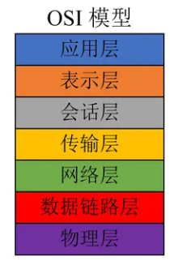
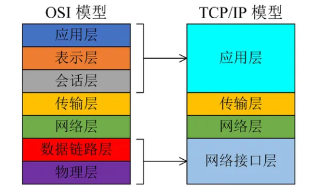
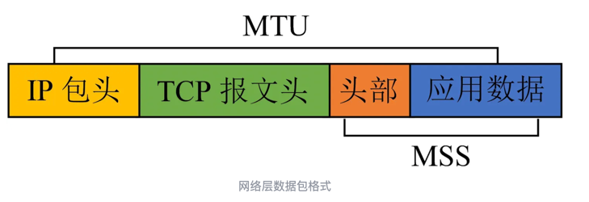

# TCP_IP协议族
文章总结自 [TCP、UDP、HTTP、SOCKET、WebSocket之间的区别](https://blog.csdn.net/sinat_31057219/article/details/72872359)  [TCP/IP 四层模型概述](https://zhuanlan.zhihu.com/p/667111007)
## 协议模型
### OSI七层模型

#### 各层作用
- 应用层：负责提供各种软件的运行环境，运行在操作系统用户态

- 表示层：负责将不同设备间传输的数据转换为彼此可以理解的格式

- 会话层：负责表示层实体之间会话的建立，管理和终止

- 传输层：负责建立不同设备之间端到端的连接

- 网络层：负责根据目的 IP 地址实现寻址及路由选择

- 数据链路层：负责数据包封帧及 MAC 寻址

- 物理层：负责数据帧在物理网络中的实际传输

### TCP/IP四层模型
#### 四层模型

### 各层协议

这里拿发一次快递作为举例

PDU 协议数据单元

应用层PDU 数据 传输层PDU 数据段 网络层PDU 数据包 物理层PDU 比特(位)

#### 应用层

应用层可以类比于我们寄快递时候的货物,货物需要进行打包，并且贴上收件人，收件地址等，这才成为一个可以运输的快递

应用层协议主要作用时将我们所需要传输的数据按照一定的数据形式和传输规则，将数据封装。

运作在应用层上的协议有HTTPS/HTTP、FTP、DNS、DHCP、SMTP等

#### 传输层

应用层可以类比于我们寄快递时候的快递站,快递站不负责实际的运输,他只会将快递分着快递公司分开然后发到不同的快递中转站，

传输层同样也并不涉及实际传输，主要作用是端口对端口的通信，运作在其上的协议主要是TCP/UPD。

<pre>
tcp协议

TCP协议通过了三次握手，四次挥手，慢启动，拥塞避免，超时重试等机制保障了数据的可靠传输，但是效率低。

TCP协议规定当报文长度超过MSS（Max Segement Size：最大报文长度）后，需要对数据报文进行分段，
然后组成TCP报文段交给网络层进行传输.

之所以在传输层将消息切片是为了更高效的解决网络层丢包的问题。如果我们不切，那么会在应用层按照MTU（Max Transport Unit：最大传输单元)来进行切片，这样
的话一旦丢包需要将整个数据来进行重发效率低下，所以在传输层就将数据切片，哪个包丢了重发就好。

tcp协议存在粘包问题，粘包的问题可以细分为 发送端粘包 和 接收端粘包
发送端粘包：
    1.tcp内部默认开启nagle算法，该算法会将较小的报文进行合并发送，这是导致粘包的原因，可以通过<a href="https://zhuanlan.zhihu.com/p/668860691">关闭nagle算法解决</a>
    2.TCP连接的发送方会将报文段放在缓冲区，等缓冲区装满之后再发送，这也会导致粘包
接收方粘包
    1.TCP连接的接收方未即使取走到达缓冲区的报文段
针对于发送端和接收端缓冲区未即使处理粘包可以采用如下策略:
    1.应用层定义消息头部,http协议就是将消息划分为头部和数据部分
    2.固定消息长度，所有消息固定长度，接收方直接按照指定长度切割，无需考虑粘包
</pre>

<pre>
udp协议

UDP协议面向无连接，只管发送，至于是否交付到接收方不作保证，所以效率高，可靠性低。
</pre>

#### 网络层
网络层类比于快递中转站，他们负责将全市的站点送来的包裹进行收集，按照地址进行分拣，并装车。

网络层收到数据传输层的数据之后，会按照MTU来进行数据切片，然后再头部添加IP包头，组成数据包。然后再通过IP协议寻址
<pre>
寻址过程

Ip由网络号 + 主机号组成,寻址时会先用 ip 和子网掩码进行 与运算 然后再自身的路由表中寻找结果与该结果相同的路由器表项（说明网络号相同,同属于一个子网），发送给路由器。
如果没找到就回吧报文发送给默认网关，网关会重复之前的操作，直到找到目标低至所在子网，最后广播目标IP地址。
</pre>

如果某个阶段没有找到合适的路由，则会产生 ICMP 报错数据包
如果是直连路由（即同一个子网内）则按照第二层 MAC 地址直接发送数据

#### 网络接口层
网络接口层类比于快递车运输，负责实际的运输。

通过ip寻址和路由器选择我们知道了要发送数据去哪，但是ip仅仅可以确定我们要发到那个子网，子网内部的设备之间的数据传输就需要依靠mac地址来解决了。

<pre>
mac寻址过程

每个入网的网卡本身会写在一个48位的mac地址，是生产时候就被写入到rom中的，自身的mac地址都可以通过rom获取
下个节点的mac地址可以通过地址转换协议ARP获取
源主机会广播 FF:FF:FF:FF:FF:FF + 目的主机 IP 地址 给子网内所有的主机
目标机器收到指令后发现ip与自身ip相同，那么就会返回给请求方，请求方获取下个mac地址后，会将这对地址缓存到ARP缓存空间中，下次查询就有可能命中，一般只存几分钟
</pre>

