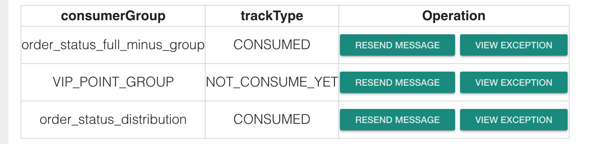
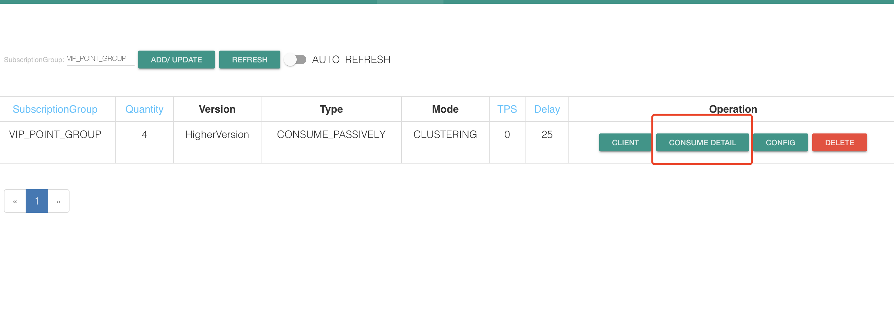
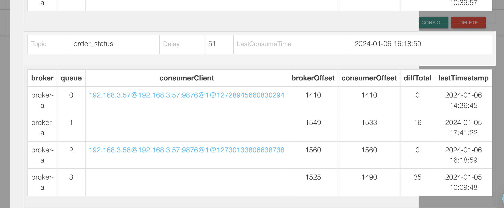

## 问题描述

> **观察到积分记录同步服务/订单信息变更处理服务**

**消息长时间不消费，并且手动发放消息可以接收到。**

## 问题快照

> 可以截一些bug的堆栈信息等留存

- 堆栈信息1

## 排查过程

> 记录排查执行过程方便优化下次排查过程。

- 尝试去百度了一下NOT_CONSUME_YET的问题

[https://www.cnblogs.com/cuianbing/p/17028191.html](https://www.cnblogs.com/cuianbing/p/17028191.html)

找到了这么一篇结果，虽然情况不一样，但是参照他的分析过程我也分析了一下，目前topic的各个节点情况，附图再描述中

- 结合代码以及控制台的信息观察了下情况

发现4个queue只有2个queue被注册了数据，跟其他的topic都不一样，然后就去代码里看了下，发现2个监听器用了一个topic。预感可能与这个有关

- 百度了一下统一消费者组 消费 不同的topic

果然有问题，具体链接如下，还没有细细分析

[https://blog.csdn.net/weixin_35973945/article/details/118298429](https://blog.csdn.net/weixin_35973945/article/details/118298429)

## 原因

> 最终形成原因记录

1.同一消费者组，只能消费同一个topic，但是我消费了多个topic

2.这就造成了某一个topic的不同queue被覆盖

3.所以当消息发送到被覆盖的queue之后，一直不会被消费

4.这也解释了为什么状态一直是NOT_CONSUME_YET

## 解决方案

> 针对原因执行解决方案

    更换不同的消费者组一个topic对应一个group

