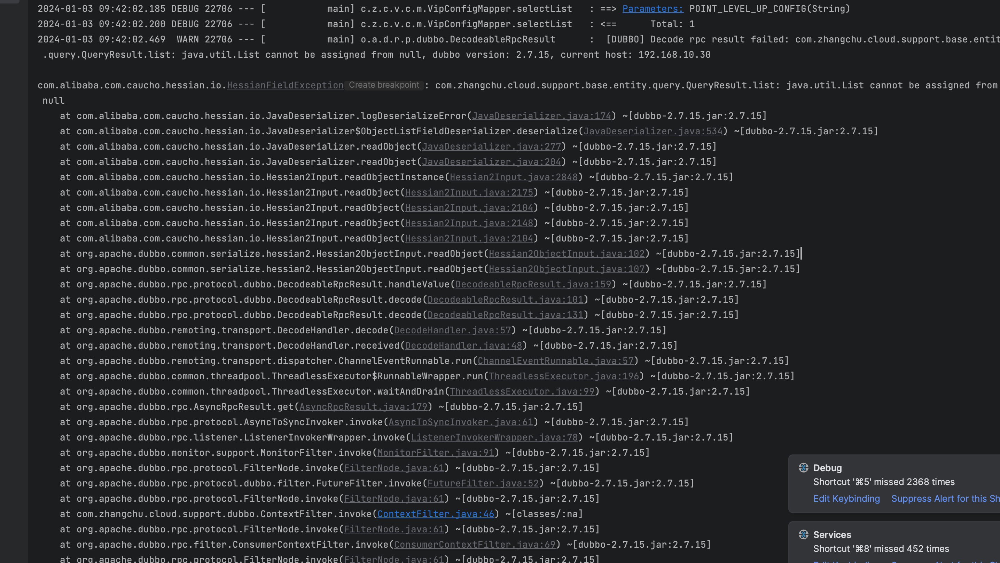
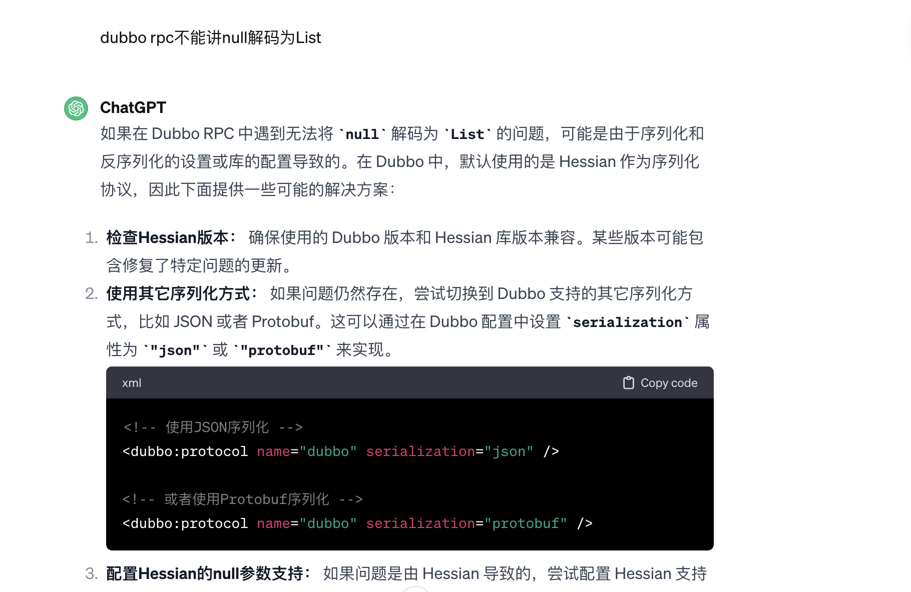
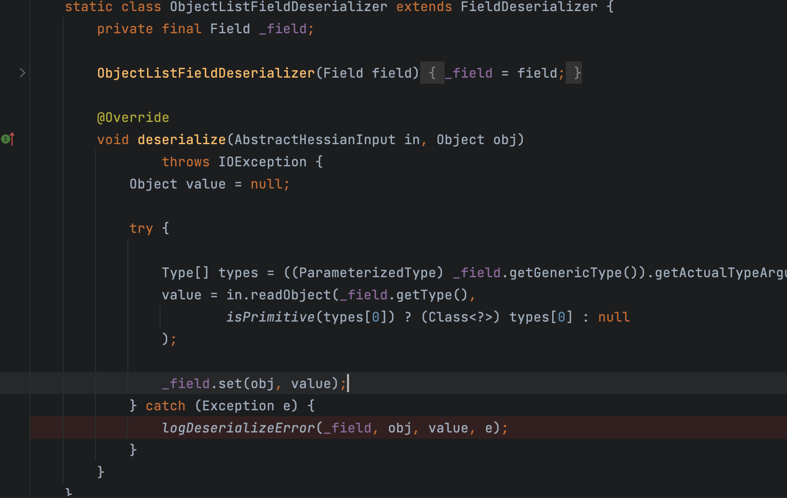

## 问题描述

做消费升级的时候，需要拉取用户订单信息来获取用户消费金额，并计算升级条件。rpc调用商城服务时抛出异常

## 问题快照

## 排查过程

> 记录排查执行过程方便优化下次排查过程。

- 写单元测试复现问题

    - 获取到了问题的堆栈信息，并看到了错误原因是因为最后一页的查询的list返回结果为null

- 百度去看看是否有人直接碰到了这样的问题i

    - 并没有人直接碰到了这样的问题

- 尝试讲问题堆栈信息直接贴给chatGPT

    - gpt给了一个很笼统的排查rpc问题的步骤

- 尝试问的更细一点（dubbo rpc不能将null解码为List）

    - 推荐了去修改dubbo的配置，将序列化插件从hsession2改为json

    - 改为json后发现报错无法匹配到插件，于是定位到dubbo源码中，看到配置为fastjson

    - 尝试重新运行单元测试，执行仍旧异常

- 尝试debug源

    - 在error异常处创建断点，追踪到异常抛出上级在dubbo的类型转换器

    - 进一步去在断点中执行每一步定位到报错是在in.readObject时

    - 阅读下这段代码发现作用是判断范型类型是否是原始数据类型的，不是的话就传入null

    - 通过readObject方法的入参，expectedTypes，进行猜测，可能是list属性设置了空集合导致的

- 尝试修改代码后进行测试

    - 测试通过，假设成立。

- 通过尝试将空集合设置成ArrayList和null和List.of来进行测试发现仅有List.of情况下会出错

    - 推翻了之前的假设

- 尝试通过搜索引擎搜索关键字 List.of()序列化异常

    - 发现了确实有人碰到了这种问题

## 原因

- List.of()返回的是一个不可变集合,该集合类型为ListN

- ListN集合继承了AbstractImmutableList, 实现了序列化接口,并实现了自定义的序列化方法,readObject和writeReplace方法.

- 可能是与找不到对应的序列化方法导致的

- list.of相关文档

[https://baijiahao.baidu.com/s?id=1782478218721668190&wfr=spider&for=pc](https://baijiahao.baidu.com/s?id=1782478218721668190&wfr=spider&for=pc)

- 自定义序列化相关文档

[https://cloud.tencent.com/developer/article/1338442](https://cloud.tencent.com/developer/article/1338442)

## 解决方案

商城端新增rpcPage方法，将返回值为空的list重新设置一个值即可

