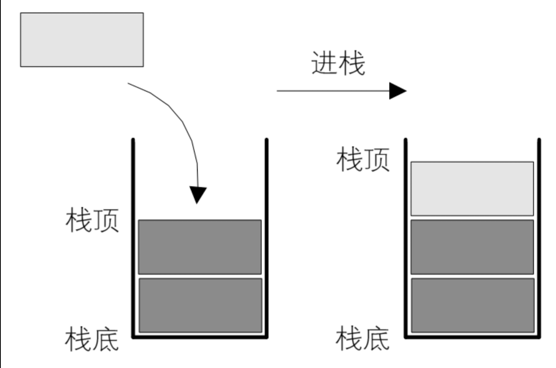
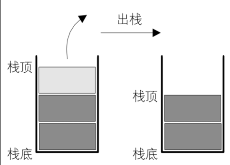

# 栈
## 定义
栈是一种[特殊的线性表](),只可以在[线性表的底部]()进行插入和删除操作.

线性表的头部被称为[栈底](),底部被成为[栈顶](),也就是说栈只可以在[栈顶]()进行插入或者删除操作

插入操作被称为[压栈(push)]()

删除操作被叫做[弹栈(pop)]().

## 抽象数据类型
### 数据
[AbstractStack](ArrayStack.java)

### 行为
[IStack](IStack.java)