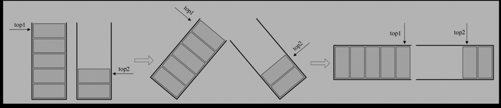

# 栈
## 定义
栈是一种[特殊的线性表](),只可以在[线性表的底部]()进行插入和删除操作.

线性表的头部被称为[栈底](),底部被成为[栈顶](),也就是说栈只可以在[栈顶]()进行插入或者删除操作

插入操作被称为[压栈(push)]()

删除操作被叫做[弹栈(pop)]().

## 抽象数据类型
### 数据
[AbstractStack](ArrayStack.java)

### 行为
[IStack](IStack.java)

[IShardedStack.java](IShardedStack.java)

## 栈的种类

### 数组栈和链表栈
因为栈是特殊的线性表，所以很自然的就想到存在数组和链表两种实现方式。
个人觉得数组这种方式特别合适，因为我们限定了所有操作都要在栈顶，而链表方式会多一些额外开销。

### 共享栈
共享栈就是两个栈分享一个数组/节点链表，栈顶由单个栈的时候的数组最大值，变成了两个栈顶"发生碰撞"
